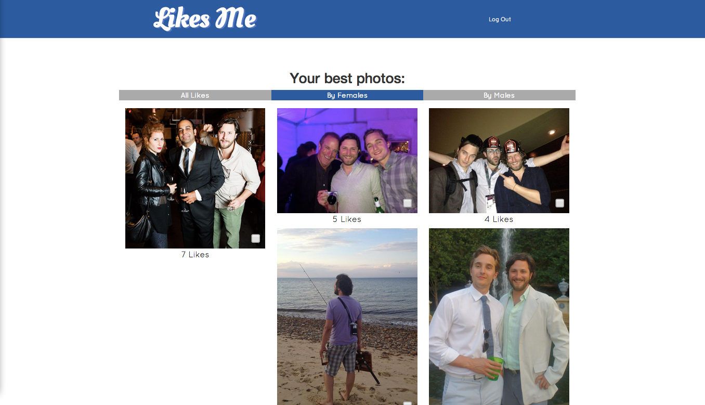
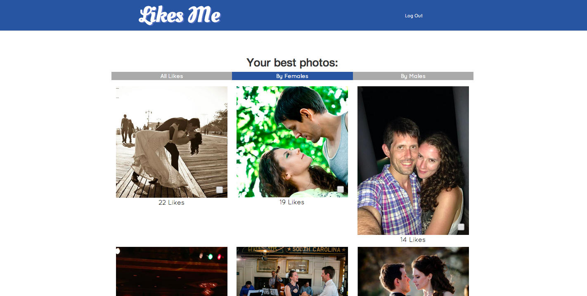
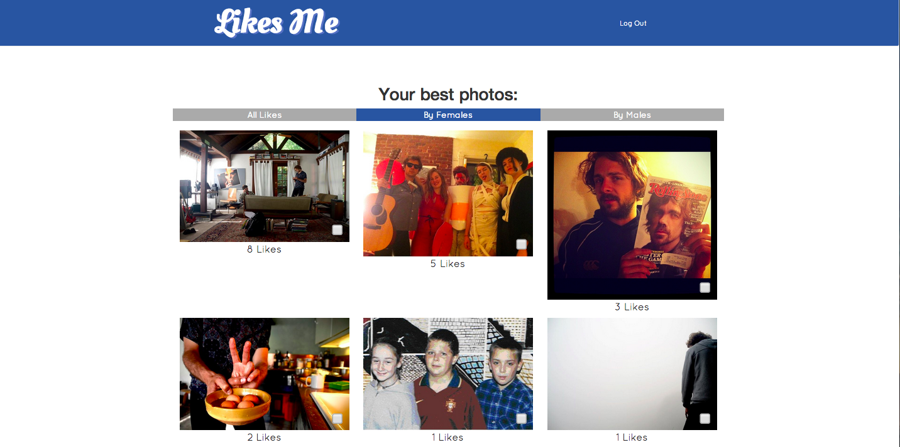
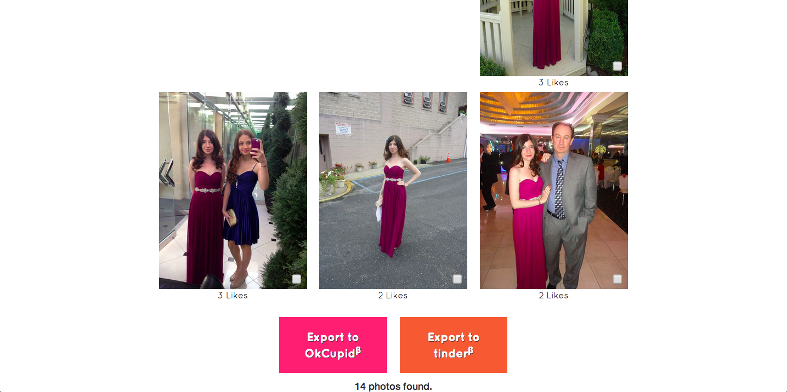
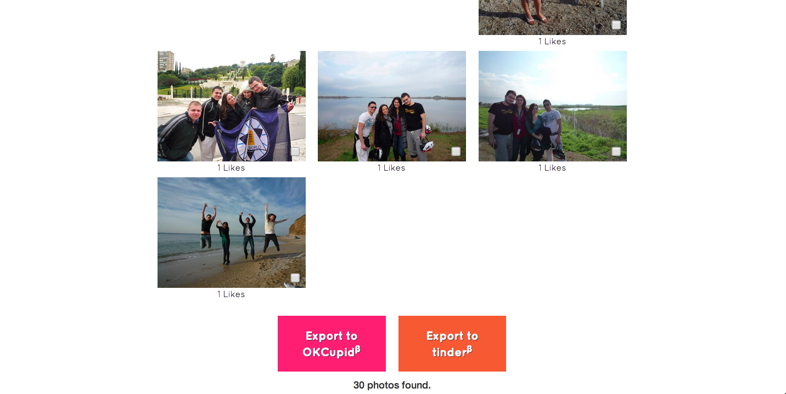

#LIKES ME

##Find your best facebook photos!

* Best photos selected based on 
  * number of likes
    * 1 min
  * number of other people in the photo
    * 4 max
* Photos can be sorted by
  * total likes
  * likes by females only
  * likes by males only
* Photos can be exported to dating websites - not implemented yet
  * OKCupid
  * tinder
  
  
##Visit
HEROKU: http://likes-me.herokuapp.com

##Screenshots


1. Organize photos by popularity (All Likes, By Females, By Males)


2. Another example. Find your most liked images!


3. Even more fun than facebook.


4. Conveniently export to dating websites - not yet implememted


5. *OKCupid* and *tinder* compatible - not yet implemented

##Testing!


##Implementation
Incorporates Facebook's Graph API using the *Koala* gem.

Uses batched facebook queries to improve efficiency and reduce API calls!
See sample below:
```ruby
results = graph.batch do |batch_api|
  batch_api.get_connections(photo["id"], "likes", {:limit => 25}, :batch_args => {:name => "get-likes", :omit_response_on_success => false})
  batch_api.get_objects("{result=get-likes:$.data.*.id}")  
end
````


###Thanks for visiting!!


